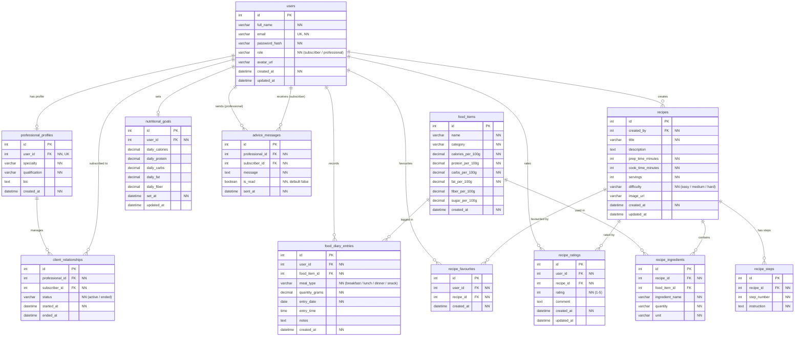

# Good Food & Healthy Eating — ER Diagram

## Entity Relationship Diagram (Mermaid)

## Table Descriptions

| Table | Description |
|-------|-------------|
| **users** | All users (subscribers and health professionals). `role` distinguishes user type. |
| **professional_profiles** | Extended profile for health professionals (specialty, qualifications). |
| **client_relationships** | Links professionals to their subscriber clients. |
| **food_items** | Food database with nutritional information per 100g. |
| **food_diary_entries** | Daily food intake log — the "food diary" feature. |
| **nutritional_goals** | Personalised nutritional targets set by/for a subscriber. |
| **advice_messages** | Messages from professionals to their clients. |
| **recipes** | Home cooking recipes with metadata. |
| **recipe_ingredients** | Ingredients for each recipe, optionally linked to food_items. |
| **recipe_steps** | Step-by-step cooking instructions. |
| **recipe_favourites** | Subscribers' saved/favourite recipes. |
| **recipe_ratings** | Ratings and comments on recipes. |

## Key Relationships

- A **user** can be a subscriber or a professional (role-based).
- A **professional** manages multiple subscribers via `client_relationships`.
- Subscribers record daily food intake in `food_diary_entries`, referencing `food_items`.
- Professionals send `advice_messages` to their subscribers.
- Anyone can create **recipes**; subscribers can **favourite** and **rate** them.
- `recipe_ingredients` optionally links to `food_items` for nutritional calculations.
