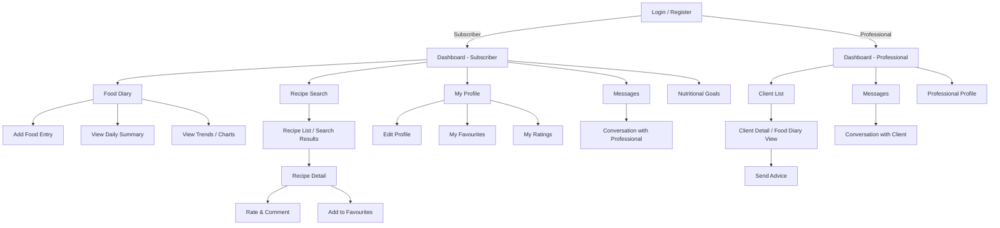

# Good Food & Healthy Eating — UI Wireframes

## Page Flow Overview



---

## Wireframe Descriptions (per page)

### 1. Login / Register Page

```
┌──────────────────────────────────┐
│        Good Food & Healthy       │
│            Eating 🥗              │
│                                  │
│  ┌────────────────────────────┐  │
│  │ Email address              │  │
│  └────────────────────────────┘  │
│  ┌────────────────────────────┐  │
│  │ Password                   │  │
│  └────────────────────────────┘  │
│                                  │
│  [       Login        ]          │
│                                  │
│  Don't have an account?          │
│  [     Register       ]          │
│──────────────────────────────────│
│                                  │
│  REGISTER FORM:                  │
│  ┌────────────────────────────┐  │
│  │ Full name                  │  │
│  └────────────────────────────┘  │
│  ┌────────────────────────────┐  │
│  │ Email address              │  │
│  └────────────────────────────┘  │
│  ┌────────────────────────────┐  │
│  │ Password                   │  │
│  └────────────────────────────┘  │
│  ┌────────────────────────────┐  │
│  │ Confirm password           │  │
│  └────────────────────────────┘  │
│                                  │
│  Role:  (○) Subscriber           │
│         (○) Professional         │
│                                  │
│  [      Register      ]          │
└──────────────────────────────────┘
```

---

### 2. Subscriber Dashboard

```
┌──────────────────────────────────┐
│  ☰  Good Food & Healthy Eating   │
│──────────────────────────────────│
│                                  │
│  Welcome back, [Name]!           │
│                                  │
│  ┌──────────┐  ┌──────────┐     │
│  │ 📓       │  │ 🍳       │     │
│  │ Food     │  │ Recipes  │     │
│  │ Diary    │  │          │     │
│  └──────────┘  └──────────┘     │
│  ┌──────────┐  ┌──────────┐     │
│  │ 🎯       │  │ 💬       │     │
│  │ My Goals │  │ Messages │     │
│  │          │  │          │     │
│  └──────────┘  └──────────┘     │
│                                  │
│  TODAY'S SUMMARY                 │
│  ┌────────────────────────────┐  │
│  │ Calories: 1520 / 2000      │  │
│  │ ████████████░░░░  76%      │  │
│  │ Protein:  65g / 80g        │  │
│  │ Carbs:    180g / 250g      │  │
│  │ Fat:      50g / 65g        │  │
│  └────────────────────────────┘  │
│                                  │
│  [🏠 Home] [📓 Diary] [🍳 Recipe] [👤 Profile]│
└──────────────────────────────────┘
```

---

### 3. Food Diary Page

```
┌──────────────────────────────────┐
│  ←  Food Diary                   │
│──────────────────────────────────│
│  ◀  March 4, 2026  ▶            │
│                                  │
│  BREAKFAST                       │
│  ┌────────────────────────────┐  │
│  │ 🥣 Oatmeal     250g  220cal│  │
│  │ 🍌 Banana      120g  107cal│  │
│  └────────────────────────────┘  │
│                                  │
│  LUNCH                           │
│  ┌────────────────────────────┐  │
│  │ 🥗 Salad       300g  150cal│  │
│  │ 🍗 Chicken     200g  330cal│  │
│  └────────────────────────────┘  │
│                                  │
│  DINNER                          │
│  ┌────────────────────────────┐  │
│  │ (No entries yet)           │  │
│  └────────────────────────────┘  │
│                                  │
│  SNACK                           │
│  ┌────────────────────────────┐  │
│  │ (No entries yet)           │  │
│  └────────────────────────────┘  │
│                                  │
│  [  + Add Food Entry  ]         │
│                                  │
│  [📊 View Trends]               │
│──────────────────────────────────│
│  [🏠 Home] [📓 Diary] [🍳 Recipe] [👤 Profile]│
└──────────────────────────────────┘
```

---

### 4. Add Food Entry

```
┌──────────────────────────────────┐
│  ←  Add Food Entry               │
│──────────────────────────────────│
│                                  │
│  Search Food:                    │
│  ┌────────────────────────────┐  │
│  │ 🔍  Search food items...   │  │
│  └────────────────────────────┘  │
│                                  │
│  Search Results:                 │
│  ┌────────────────────────────┐  │
│  │ ☐ Oatmeal   (220cal/100g) │  │
│  │ ☐ Rice      (130cal/100g) │  │
│  │ ☐ Bread     (265cal/100g) │  │
│  └────────────────────────────┘  │
│                                  │
│  Meal Type:                      │
│  [Breakfast ▾]                   │
│                                  │
│  Quantity (grams):               │
│  ┌────────────────────────────┐  │
│  │ 250                        │  │
│  └────────────────────────────┘  │
│                                  │
│  Notes (optional):               │
│  ┌────────────────────────────┐  │
│  │                            │  │
│  └────────────────────────────┘  │
│                                  │
│  [      Add Entry     ]         │
└──────────────────────────────────┘
```

---

### 5. Nutrition Trends / Charts

```
┌──────────────────────────────────┐
│  ←  Nutritional Trends           │
│──────────────────────────────────│
│  Period: [This Week ▾]           │
│                                  │
│  CALORIE INTAKE                  │
│  ┌────────────────────────────┐  │
│  │     ╭─╮                    │  │
│  │  ╭──╯ ╰─╮   ╭──╮         │  │
│  │──╯       ╰───╯  ╰──       │  │
│  │ Mon Tue Wed Thu Fri Sat Sun│  │
│  │ --- target line (2000) --- │  │
│  └────────────────────────────┘  │
│                                  │
│  MACRONUTRIENT BREAKDOWN         │
│  ┌────────────────────────────┐  │
│  │    ┌──────┐                │  │
│  │    │Carbs │ 45%            │  │
│  │    │Prot  │ 30%            │  │
│  │    │Fat   │ 25%            │  │
│  │    └──────┘                │  │
│  └────────────────────────────┘  │
│                                  │
│  NUTRITIONAL GUIDELINES FEEDBACK │
│  ┌────────────────────────────┐  │
│  │ ✅ Protein goal met        │  │
│  │ ⚠️ Increase fiber intake   │  │
│  │ ✅ Fat within healthy range│  │
│  └────────────────────────────┘  │
└──────────────────────────────────┘
```

---

### 6. Recipe Search

```
┌──────────────────────────────────┐
│  ←  Recipe Search                │
│──────────────────────────────────│
│                                  │
│  ┌────────────────────────────┐  │
│  │ 🔍 Search recipes...       │  │
│  └────────────────────────────┘  │
│                                  │
│  Filter by:                      │
│  [Difficulty ▾] [Ingredient ▾]   │
│  [Prep Time ▾]                   │
│                                  │
│  ┌────────────────────────────┐  │
│  │ ┌──────┐                   │  │
│  │ │ IMG  │  Chicken Salad    │  │
│  │ │      │  ⏱ 20 min | Easy  │  │
│  │ └──────┘  ⭐ 4.5 (23)      │  │
│  ├────────────────────────────┤  │
│  │ ┌──────┐                   │  │
│  │ │ IMG  │  Veggie Stir Fry  │  │
│  │ │      │  ⏱ 30 min | Medium│  │
│  │ └──────┘  ⭐ 4.2 (15)      │  │
│  ├────────────────────────────┤  │
│  │ ┌──────┐                   │  │
│  │ │ IMG  │  Oatmeal Bowl     │  │
│  │ │      │  ⏱ 10 min | Easy  │  │
│  │ └──────┘  ⭐ 4.8 (42)      │  │
│  └────────────────────────────┘  │
│──────────────────────────────────│
│  [🏠 Home] [📓 Diary] [🍳 Recipe] [👤 Profile]│
└──────────────────────────────────┘
```

---

### 7. Recipe Detail

```
┌──────────────────────────────────┐
│  ←  Recipe Detail                │
│──────────────────────────────────│
│  ┌────────────────────────────┐  │
│  │                            │  │
│  │       [Recipe Image]       │  │
│  │                            │  │
│  └────────────────────────────┘  │
│                                  │
│  Chicken Salad          ♡ Save   │
│  ⭐ 4.5 (23 reviews)             │
│  ⏱ 20 min | 🍽 2 servings | Easy │
│                                  │
│  INGREDIENTS                     │
│  ┌────────────────────────────┐  │
│  │ • Chicken breast  200g     │  │
│  │ • Mixed greens    150g     │  │
│  │ • Cherry tomatoes 100g     │  │
│  │ • Olive oil       2 tbsp   │  │
│  └────────────────────────────┘  │
│                                  │
│  NUTRITION (per serving)         │
│  ┌────────────────────────────┐  │
│  │ Cal: 320 | Prot: 35g      │  │
│  │ Carb: 12g | Fat: 15g      │  │
│  └────────────────────────────┘  │
│                                  │
│  STEPS                           │
│  ┌────────────────────────────┐  │
│  │ 1. Season and grill chicken│  │
│  │ 2. Wash and chop greens   │  │
│  │ 3. Combine all ingredients │  │
│  │ 4. Drizzle with olive oil  │  │
│  └────────────────────────────┘  │
│                                  │
│  [  ⭐ Rate & Comment  ]         │
│                                  │
│  REVIEWS                         │
│  ┌────────────────────────────┐  │
│  │ Jane D.  ⭐⭐⭐⭐⭐            │  │
│  │ "Delicious and easy!"     │  │
│  │                            │  │
│  │ Mark S.  ⭐⭐⭐⭐              │  │
│  │ "Great recipe, added lemon"│  │
│  └────────────────────────────┘  │
└──────────────────────────────────┘
```

---

### 8. Messages (Subscriber View)

```
┌──────────────────────────────────┐
│  ←  Messages                     │
│──────────────────────────────────│
│                                  │
│  Your Nutritionist: Dr. Smith    │
│                                  │
│  ┌────────────────────────────┐  │
│  │          Mar 3, 2026       │  │
│  │                            │  │
│  │  ┌──────────────────────┐  │  │
│  │  │ Dr. Smith:           │  │  │
│  │  │ Great progress this  │  │  │
│  │  │ week! Try to add more│  │  │
│  │  │ fiber to your diet.  │  │  │
│  │  └──────────────────────┘  │  │
│  │                            │  │
│  │    ┌──────────────────┐    │  │
│  │    │ Me:              │    │  │
│  │    │ Thanks! Any food │    │  │
│  │    │ suggestions?     │    │  │
│  │    └──────────────────┘    │  │
│  └────────────────────────────┘  │
│                                  │
│  ┌─────────────────────┐ [Send]  │
│  │ Type a message...   │         │
│  └─────────────────────┘         │
└──────────────────────────────────┘
```

---

### 9. Nutritional Goals

```
┌──────────────────────────────────┐
│  ←  Nutritional Goals            │
│──────────────────────────────────│
│                                  │
│  Set Your Daily Targets          │
│                                  │
│  Calories (kcal):                │
│  ┌────────────────────────────┐  │
│  │ 2000                       │  │
│  └────────────────────────────┘  │
│                                  │
│  Protein (g):                    │
│  ┌────────────────────────────┐  │
│  │ 80                         │  │
│  └────────────────────────────┘  │
│                                  │
│  Carbohydrates (g):              │
│  ┌────────────────────────────┐  │
│  │ 250                        │  │
│  └────────────────────────────┘  │
│                                  │
│  Fat (g):                        │
│  ┌────────────────────────────┐  │
│  │ 65                         │  │
│  └────────────────────────────┘  │
│                                  │
│  Fiber (g):                      │
│  ┌────────────────────────────┐  │
│  │ 30                         │  │
│  └────────────────────────────┘  │
│                                  │
│  [    Save Goals    ]            │
└──────────────────────────────────┘
```

---

### 10. Professional Dashboard

```
┌──────────────────────────────────┐
│  ☰  Professional Dashboard       │
│──────────────────────────────────│
│                                  │
│  Welcome, Dr. Smith!             │
│                                  │
│  MY CLIENTS (5)                  │
│  ┌────────────────────────────┐  │
│  │ 👤 Alice Johnson           │  │
│  │    Status: On track ✅      │  │
│  │    Last entry: Today       │  │
│  ├────────────────────────────┤  │
│  │ 👤 Bob Williams            │  │
│  │    Status: Needs attention ⚠️│ │
│  │    Last entry: 3 days ago  │  │
│  ├────────────────────────────┤  │
│  │ 👤 Carol Davis             │  │
│  │    Status: On track ✅      │  │
│  │    Last entry: Yesterday   │  │
│  └────────────────────────────┘  │
│                                  │
│  [🏠 Home] [👥 Clients] [💬 Messages] [👤 Profile]│
└──────────────────────────────────┘
```

---

### 11. Client Detail (Professional View)

```
┌──────────────────────────────────┐
│  ←  Client: Alice Johnson        │
│──────────────────────────────────│
│                                  │
│  WEEKLY OVERVIEW                 │
│  ┌────────────────────────────┐  │
│  │ Avg Daily Calories: 1850   │  │
│  │ Goal: 2000  ✅              │  │
│  │ Avg Protein: 72g / 80g     │  │
│  │ Diary Entries this week: 18│  │
│  └────────────────────────────┘  │
│                                  │
│  FOOD DIARY (read-only)          │
│  ┌────────────────────────────┐  │
│  │ ◀  March 4, 2026  ▶       │  │
│  │                            │  │
│  │ Breakfast:                 │  │
│  │  Oatmeal 250g, Banana 120g│  │
│  │ Lunch:                     │  │
│  │  Salad 300g, Chicken 200g  │  │
│  └────────────────────────────┘  │
│                                  │
│  TRENDS                          │
│  ┌────────────────────────────┐  │
│  │  [Calorie Chart - 7 days]  │  │
│  └────────────────────────────┘  │
│                                  │
│  [  💬 Send Advice  ]            │
└──────────────────────────────────┘
```

---

### 12. My Profile / Favourites

```
┌──────────────────────────────────┐
│  ←  My Profile                   │
│──────────────────────────────────│
│                                  │
│      ┌──────┐                    │
│      │Avatar│                    │
│      └──────┘                    │
│      Alice Johnson               │
│      alice@email.com             │
│                                  │
│  [Edit Profile]                  │
│                                  │
│  ─────────────────────────────   │
│  MY FAVOURITE RECIPES            │
│  ┌────────────────────────────┐  │
│  │ ♥ Chicken Salad    ⭐ 4.5  │  │
│  │ ♥ Oatmeal Bowl     ⭐ 4.8  │  │
│  │ ♥ Veggie Wrap      ⭐ 4.1  │  │
│  └────────────────────────────┘  │
│                                  │
│  MY RATINGS & REVIEWS            │
│  ┌────────────────────────────┐  │
│  │ Chicken Salad  ⭐⭐⭐⭐⭐      │  │
│  │ "Love this recipe!"       │  │
│  │                            │  │
│  │ Veggie Wrap    ⭐⭐⭐⭐        │  │
│  │ "Quick and tasty"         │  │
│  └────────────────────────────┘  │
│──────────────────────────────────│
│  [🏠 Home] [📓 Diary] [🍳 Recipe] [👤 Profile]│
└──────────────────────────────────┘
```

---

## User Flow Summary

### Subscriber Flow:
```
Login → Dashboard → Food Diary → Add Entry → View Trends
                  → Recipe Search → Recipe Detail → Rate / Favourite
                  → Nutritional Goals
                  → Messages (from Professional)
                  → Profile / Favourites
```

### Professional Flow:
```
Login → Dashboard → Client List → Client Detail → View Diary → Send Advice
                  → Messages → Conversation with Client
                  → Profile
```
