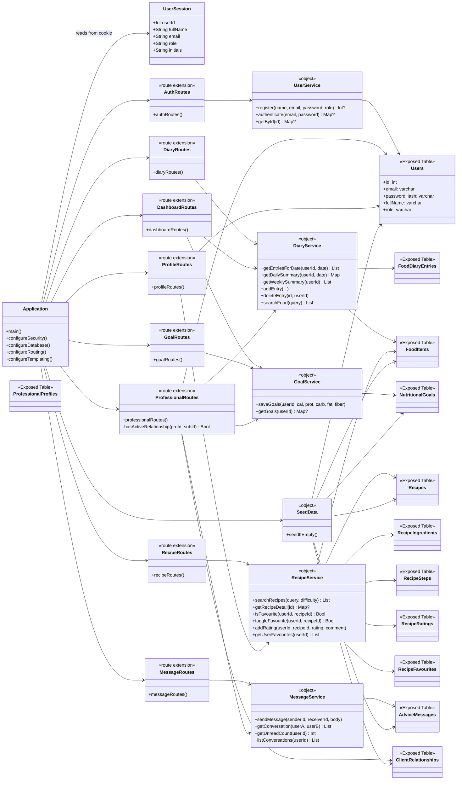

# Class Diagram — Good Food & Healthy Eating

This diagram complements [`ER_diagram.md`](ER_diagram.md). The ER diagram covers the database layer; this one covers the application layer — Ktor route extension functions, the service layer that owns business logic, and the Exposed `Table` objects that map onto database tables.

The codebase is organised by **feature module** (each module folder contains its own table objects, routes, and service), so the diagram is grouped that way.

## Application-layer class diagram

## Layering rules

1. **Routes** depend on **services**; never on table objects directly.
2. **Services** depend on **table objects** (Exposed DSL); never on routes.
3. **Table objects** are pure schema definitions and depend on nothing in the codebase except other table objects (for foreign keys).
4. `Application` wires everything together but contains no business logic.
5. `SeedData` is allowed to write through table objects directly because it bootstraps the DB before services run.

## Cross-cutting

- All routes read `UserSession` from the cookie (`config/Security.kt`) for authentication and role-based authorisation.
- `ProfessionalRoutes` additionally calls `hasActiveRelationship()` on `ClientRelationships` to enforce the IDOR-safe authorisation pattern (added in v0.4.4).

## How to view this file

GitHub renders Mermaid diagrams natively — open this file directly in the browser.
